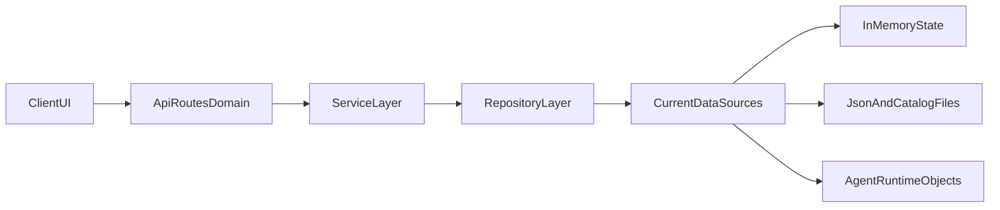
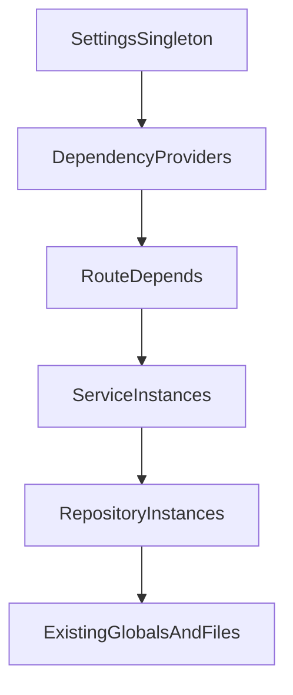

# Three-Layer Backend Refactor Plan (80/20)

## Scope (This Pass)

- Migrate all current backend endpoints in one pass:
  - `/api/train`*
  - `/api/chat`
  - `/api/datasets`, `/api/models`, `/api/trained-models`
- Repository layer wraps current data sources first (in-memory stores + JSON/file access), without Redis/SQLite changes.
- Preserve existing SSE payloads, thread behavior, and agent runtime behavior.

## Target Architecture

## 80/20 File Layout

- `backend/api/routes/train_routes.py`
- `backend/api/routes/chat_routes.py`
- `backend/api/routes/catalog_routes.py`
- `backend/services/train_service.py`
- `backend/services/chat_service.py`
- `backend/services/catalog_service.py`
- `backend/repositories/train_repository.py`
- `backend/repositories/chat_repository.py`
- `backend/repositories/catalog_repository.py`
- `backend/core/settings.py`
- `backend/core/dependencies.py`
- Keep interfaces lightweight (type hints only for now); postpone full ABC/protocol framework.
- Keep `app.py` as composition root only (app init, middleware, router include).

## Function Naming Contract (Route -> Service -> Repository)

Use identical verb names per use case so route->service->repo is easy to follow.

- `get_datasets(...)`
- `get_models(...)`
- `get_trained_models(...)`
- `start_training(...)`
- `get_training_status(...)`
- `cancel_training(...)`
- `train_stream(...)`
- `train_resume(...)`
- `chat(...)`

Each route function calls the same-named service function, which calls the same-named repository function(s) for easy tracing.

## Dependency Injection (Minimal, High Value)

- Add providers in `core/dependencies.py`:
  - `get_settings()`
  - `get_train_repository()` / `get_train_service()`
  - `get_chat_repository()` / `get_chat_service()`
  - `get_catalog_repository()` / `get_catalog_service()`
- Route handlers use `Depends(...)`; no direct global-state mutation in routes.

## Settings Centralization (Required)

- Create `core/settings.py` (Pydantic `BaseSettings`) for:
  - `PROJECT_ROOT`, `DATASETS_DIR`, `DATASETS_CATALOG_PATH`, `MODELS_REGISTRY_PATH`
  - CORS origins
  - API title/version/port defaults
- Replace scattered constants/env/path lookups with injected `Settings` object.

## Implementation Steps (80/20 Order)

1. Add `core/settings.py` and `core/dependencies.py`.
2. Extract domain routers from `app.py` (`train`, `chat`, `catalog`) with unchanged behavior.
3. Add thin services with identical function names.
4. Add repositories that wrap current in-memory state and file I/O.
5. Wire routes -> services -> repositories via DI.
6. Trim `app.py` to app construction + middleware + router includes.
7. Run endpoint/SSE smoke checks and patch regressions.

## Preserve Exactly

- SSE event contract and event types for `/api/train-stream`, `/api/train-resume`, `/api/chat`.
- Existing training state behavior (`simple_agent_store`, `training_jobs`, `_last_training_context`) but accessed through repositories.
- Current threaded behavior for `/api/train` until later background-job overhaul.

## Defer To Phase 2 (Not In This Pass)

- Full interface/ABC hierarchy and strict protocol enforcement.
- Durable persistence swap (Redis/SQLite).
- Cancellation/job-queue redesign beyond current thread model.

## Expected Outcomes

- Clean domain boundaries and traceable call chain.
- Consistent interfaces and naming across layers.
- `app.py` reduced to composition root.
- Configuration centralized and easier to manage/test.
- Future persistence swap (Redis/SQLite) becomes repository-only change with minimal route/service churn.

